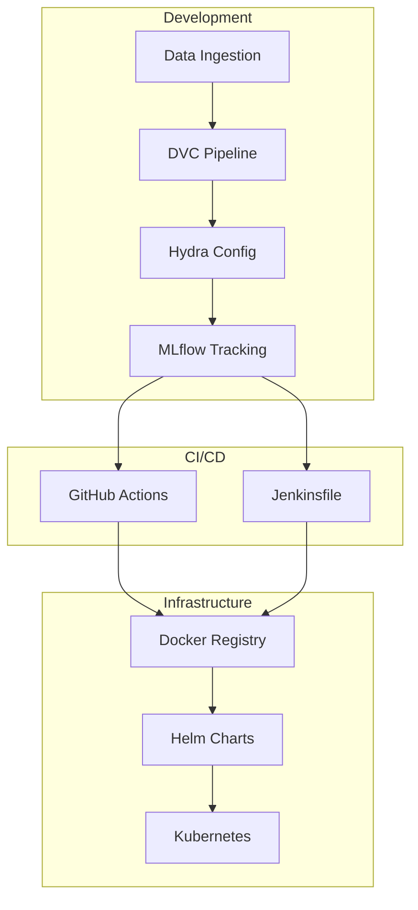

# 🚀 Enterprise MLOps Pipeline: Iris Classification

This repository contains a production-grade MLOps pipeline designed for organizational scalability. It integrates best-in-class tools for data versioning, experiment tracking, configuration management, and automated CI/CD.

---

## 🏗️ Architecture Overview

The pipeline follows a modular architecture to ensure clean separation of concerns between data science (training) and engineering (deployment).



---

## 🛠️ Key Enterprise Features

### 1. Configuration Management (Hydra)
Managed via `config/config.yaml`.
- Supports hierarchical configuration.
- Allows command-line overrides for hyperparameter tuning.

### 2. Data & Model Versioning (DVC)
- Tracks datasets in `data/raw` and `data/processed`.
- Defines reproducible stages in `dvc.yaml`.

### 3. Data Validation (Pydantic)
- Strict schemas in `src/schemas.py` validate data contracts between training and inference.
- Prevents "silent failures" caused by malformed input.

### 4. Observability (Structured Logging)
- JSON-formatted logs in `src/logger.py` for direct integration with **Datadog**, **ELK**, or **Splunk**.

### 5. Cloud-Native Serving (FastAPI + Uvicorn)
- **Direct Execution**: Optimized for Kubernetes process management and logging.
- **Self-Healing**: Integrated **Liveness** and **Readiness** probes for automated recovery.
- **Horizontal Scaling**: Managed via Kubernetes **HorizontalPodAutoscaler (HPA)** based on CPU/Memory metrics.
- **Security**: Secure inference endpoint with **API Key Authentication** (`X-API-Key`).

### Prerequisites
- Python 3.9+
- Docker & Docker Compose
- Helm (for K8s deployment)

### 1. Local Setup
```bash
make install
```

### 2. Run the Pipeline
```bash
# This triggers data prep and training defined in dvc.yaml
make train
```

### 3. Local Development (Docker-Compose)
```bash
# Starts MLflow server (5000) and API (8000)
make up
```

---

## 🧪 Jenkins CI/CD Pipeline

The `Jenkinsfile` provides a declarative pipeline for automated builds and testing:
- **Build Agent**: Uses Docker-based environments for parity.
- **Linting & Testing**: Automated `make ci` execution.
- **Pipeline Execution**: Full ML lifecycle via `dvc repro`.
- **Local Build**: Compiles a local Docker image for testing.

---

## ☸️ Kubernetes Deployment

Deploying with Helm:

```bash
# Staging Deployment
helm upgrade --install iris-api-staging ./charts/iris-api --namespace staging -f ./charts/iris-api/values-staging.yaml

# Production Deployment
helm upgrade --install iris-api-prod ./charts/iris-api --namespace production -f ./charts/iris-api/values-production.yaml
```

### Monitoring & Secrets
- **API Key**: Managed via K8s Secrets (refer to `deployment.yaml`).
- **Health Checks**: Liveness and Readiness probes are configured on `/health`.

---

### Local CI Simulation (Jenkins)
1. **Access Jenkins:** Open `http://localhost:8080`.
2. **Initial Password:** Run `docker exec jenkins_ci cat /var/jenkins_home/secrets/initialAdminPassword`.
3. **Setup:** Install suggested plugins and create a "Pipeline" job.
4. **Link Repository:** Point the job to this local directory or your Git repository.
5. **Execution:** Jenkins will use the [Jenkinsfile](Jenkinsfile) and the host's Docker socket to execute the pipeline.

```text
├── .github/          # CI/CD Workflows (GitHub)
├── charts/           # Helm Charts (Kubernetes)
├── config/           # Hydra YAML configs
├── data/             # Versioned data (DVC)
├── models/           # Local model artifacts
├── src/              # Core Python source code
│   ├── logger.py     # JSON logging
│   ├── schemas.py    # Pydantic validation
│   └── train.py      # Hydra-based training
├── app.py            # Secure FastAPI server
├── Jenkinsfile       # Jenkins Pipeline
└── dvc.yaml          # Pipeline definition
```
