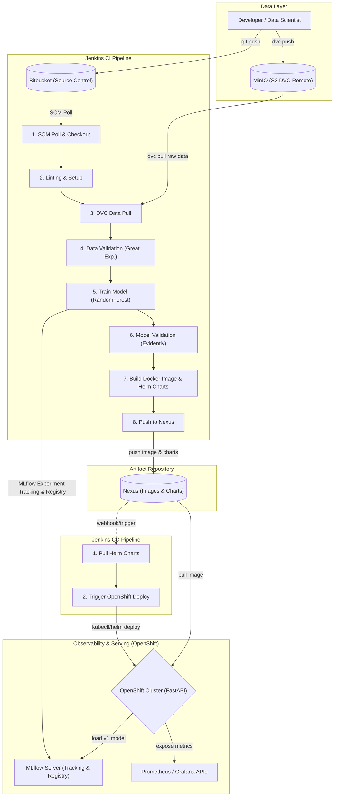

# Elite-Iris MLOps Pipeline: Architecture Diagram

```mermaid
graph TD
    subgraph Data_Layer["Data Layer"]
        Dev["Developer / Data Scientist"]
        MinIO[("MinIO (S3 DVC Remote)")]
    end

    subgraph CI_Layer["Jenkins CI Pipeline"]
        Bitbucket[("Bitbucket (Source Control)")]
        Step1["1. SCM Poll & Checkout"]
        Step2["2. Linting & Setup"]
        Step3["3. DVC Data Pull"]
        Step4["4. Data Validation (Great Exp.)"]
        Step5["5. Train Model (RandomForest)"]
        Step6["6. Model Validation (Evidently)"]
        Step7["7. Build Docker Image & Helm Charts"]
        Step8["8. Push to Nexus"]
    end

    subgraph Artifact_Repository["Artifact Repository"]
        Nexus[("Nexus (Images & Charts)")]
    end

    subgraph CD_Layer["Jenkins CD Pipeline"]
        CDStep1["1. Pull Helm Charts"]
        CDStep2["2. Trigger OpenShift Deploy"]
    end

    subgraph Observability_Serving["Observability & Serving (OpenShift)"]
        MLflow["MLflow Server (Tracking & Registry)"]
        OpenShift{"OpenShift Cluster (FastAPI)"}
        Prometheus["Prometheus / Grafana APIs"]
    end

    %% Data / Commit Flow
    Dev -- "git push" --> Bitbucket
    Dev -- "dvc push" --> MinIO
    
    %% CI Flow
    Bitbucket -- "SCM Poll" --> Step1
    Step1 --> Step2
    Step2 --> Step3
    MinIO -- "dvc pull raw data" --> Step3
    Step3 --> Step4
    Step4 --> Step5
    Step5 --> Step6
    Step6 --> Step7
    Step7 --> Step8
    
    Step5 -- "MLflow Experiment Tracking & Registry" --> MLflow
    Step8 -- "push image & charts" --> Nexus
    
    %% CD & Deploy Flow
    Nexus -. "webhook/trigger" .-> CDStep1
    CDStep1 --> CDStep2
    CDStep2 -- "kubectl/helm deploy" --> OpenShift
    Nexus -- "pull image" --> OpenShift
    
    %% Endpoints & Metrics
    OpenShift -- "load v1 model" --> MLflow
    OpenShift -- "expose metrics" --> Prometheus
```
