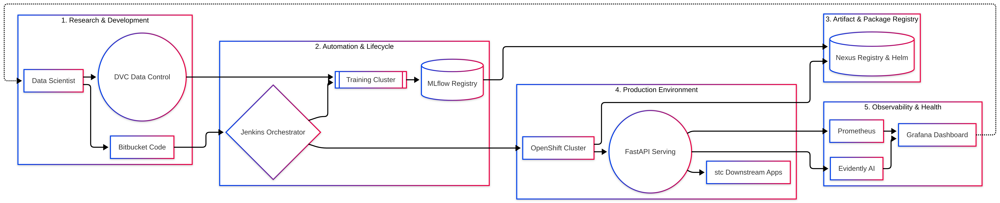

# stc CICD Framework: MLOps Production Architecture Design

## 1. L0 High-Level Architecture (Conceptual)

## 2. System Overview

The stc MLOps platform is an enterprise-grade, end-to-end machine learning pipeline designed to automate the ML lifecycle. It integrates seamlessly with the existing stc CICD framework to provide reproducible model training, strict data quality validation, scalable model serving, and comprehensive system observability. This architecture ensures that machine learning solutions transition from development to production securely, reliably, and efficiently.

## 3. Architecture Goals

* **Scalability**: The system must seamlessly handle increasing data volumes and high-throughput inference requests without degradation.
* **Reliability**: Automated testing, data validation, and automated rollback mechanisms ensure a stable production environment that minimizes model downtime.
* **Security**: The platform complies strictly with stc enterprise security standards, including role-based access control (RBAC), secure artifact storage, and encrypted data rest/transit.
* **Performance**: Fast, asynchronous serving endpoints and optimized container runtimes ensure low-latency model predictions and fast CI/CD pipeline executions.
* **Maintainability**: Utilizing Infrastructure as Code (Helm/Kubernetes) and standardized modular components ensures the platform is easily updatable and developer-friendly.

## 4. High-Level Architecture Description

The architecture leverages a containerized, cloud-native approach deployed on **Red Hat OpenShift**. It integrates the standard stc CI/CD toolchain (**Bitbucket, Jenkins, SonarQube, Nexus**) with a specialized ML lifecycle stack (**MLflow, FastAPI, MinIO, Prometheus**).

The platform separates concerns into three distinct workflows:

1. **Model Training Pipeline**: Prototyping, version-controlled training, and evaluation using validated stc data sources.
2. **Deployment (CI/CD) Pipeline**: Code and model updates trigger automated builds in Jenkins. Artifacts are stored in Nexus, and Helm charts deploy the updated services to OpenShift.
3. **Serving & Observability Pipeline**: Containerized FastAPI endpoints serve the models, while Prometheus and Evidently AI track hardware metrics and model drift, alerting stakeholders via Grafana.

## 5. Detailed Component Architecture

* **Data Sources**: Internal stc data systems (e.g., Telecom Data Warehouses, CRM APIs, external flat files). Data is consumed from these sources for model training.
* **Data Storage**:
  * **MinIO**: Highly available, S3-compatible object storage used for datasets, model binaries, and large unstructured data.
  * **CephFS**: Persistent shared file storage for cluster-wide caching and log aggregation.
  * **PostgreSQL**: Relational backend for MLflow tracking metadata.
* **Model Training System**: `scikit-learn` and contextual ML frameworks train the algorithms using prepared data. **MLflow** acts as the core registry, tracking experiments, hyperparameters, and resulting model metrics.
* **Model Serving Layer**: High-performance REST APIs built with **FastAPI** and **Uvicorn**, serving model predictions in real-time and efficiently handling batch scoring endpoints.
* **Application / UI Layer**: End-user dashboards (e.g., Streamlit or React web apps) and upstream stc microservices that consume the REST API predictions.

---

## 6. End-to-End Data Flow Detail

1. **Data Preparation**: Data is made available in MinIO or via secure API access. Basic validation ensures data readiness for the ML training task.
2. **Model Training**: The Jenkins CI pipeline executes run scripts. The model pulls prepared data, performs internal feature selection, and outputs a trained heuristic.
3. **Model Logging**: The training job logs its metrics (Accuracy, F1, etc.) to the MLflow Postgres backend, and uploads the `.pkl`/binary files to MLflow's MinIO artifact store.
4. **Containerization & Promotion**: Depending on performance thresholds, Jenkins tags the version in Bitbucket, updates the Helm Chart, and builds the Docker image. The image (FastAPI + Model) and Helm charts are pushed to the Nexus registry.
5. **Deployment to Production**: Jenkins triggers the dedicated Deploy Pipeline. The pipeline fetches the Helm charts from Nexus and initiates a `helm upgrade` on the OpenShift cluster.
6. **Inference & Monitoring**: OpenShift pulls the Docker image from Nexus. External apps send REST requests to the FastAPI service. Predictions are returned, and payload metrics are sent to Evidently AI and Prometheus to scan for data drift.

## 7. Technology Stack (With Justification)

* **Orchestration**: Red Hat OpenShift / Kubernetes (Enterprise-grade, secure, and fits existing stc infrastructure).
* **CI/CD Pipeline**: Jenkins, Bitbucket, Nexus (Standardized, mature, heavily integrated into internal automation).
* **Experiment Tracking & Registry**: MLflow (Industry standard for tracking experiments and registering model versions; lightweight and highly customizable).
* **Serving API**: FastAPI / Uvicorn (Provides extremely fast, async-capable HTTP routing out of the box with auto-generated OpenAPI documentation).
* **Observability & Drift**: Prometheus, Grafana, Evidently AI (Open-source standard for metrics visualization. Evidently specifically fills the gap for statistical model drift and data distribution shifts).
* **Infrastructure Layout**: Helm (Allows complex deployments to be templated, version-controlled, and parameterized securely).

## 8. Integration with Existing Systems

* **Bitbucket**: Acts as the single source of truth for all ML code, YAML configurations, and pipeline definitions.
* **Jenkins**: Listens via Webhooks to Bitbucket to trigger automated ML workflows.
* **Nexus Repository**: Used as the definitive storage registry for compiled Python packages, Docker container images, and proxyed pip dependencies.
* **stc Authentication Gateways**: The API layer integrates via OAuth2/OIDC boundaries established by stc IT to ensure only authenticated microservices access inference data.

## 9. Security Architecture

* **Authentication & Authorization**: Service-to-service communication is secured via OAuth2. Inside OpenShift, strict RBAC ensures isolated namespaces (Dev vs. Prod).
* **Encryption**: All data in transit utilizes TLS 1.2+. Data at rest in MinIO and PostgreSQL relies on volume-level encryption and secure key management.
* **Secret Management**: Avoids hardcoded credentials by utilizing OpenShift Secrets or external HashiCorp Vault integrations injected at runtime.
* **Image Scanning**: Images deposited in Nexus are automatically scanned for CVEs before being allowed to run in the OpenShift production namespace.

## 10. Scalability Strategy

* **Auto-Scaling (HPA)**: The FastAPI deployment on OpenShift uses Horizontal Pod Autoscalers (HPA) to dynamically increase the number of API pods based on CPU/Memory usage during peak traffic.
* **Distributed Systems**: MinIO is configured in HA distributed mode, ensuring high-throughput read/writes for models and datasets even under heavy concurrent loads.
* **Stateless Inference**: By fully decoupling the storage layer from the compute layer, the REST APIs remain 100% stateless and perfectly scalable.

## 11. Observability

* **Logging**: Standardized JSON logging (via `python-json-logger`) aggregated by Fluentd/ELK stack.
* **Hardware and System Monitoring**: Prometheus scrapes standard metrics from the MLflow and FastAPI environments to monitor pod health, latency, and system resource exhaustion.
* **ML Health (Alerting)**: Evidently AI compares production-scoring distributions against the baseline training distribution. If statistical data drift is detected, an alert is triggered in Grafana to warn the Data Science team that retraining is required.

## 12. Deployment Strategy

* **CI/CD Pipelines**: Multibranch pipelines handle dev, staging, and master branches. Code merges to main trigger standard build-test-deploy operations seamlessly via Jenkinsfiles.
* **Containerization**: Python runtimes are locked to specific versions in Dockerfiles with `requirements.txt`.
* **Orchestration**: Helm charts manage all Kubernetes manifest generation. Environments (dev, stage, prod) are differentiated simply by providing different `values.yaml` files.

## 13. Disaster Recovery & High Availability

* **High Availability**: Critical components (PostgreSQL, MinIO, FastAPI instances) run with a minimum of 3 replicas across multiple OpenShift worker nodes to protect against single-node failures.
* **Backup and Restore**:
  * MLflow's PostgreSQL database undergoes continuous automated backups.
  * MinIO utilizes bucket replication to maintain synchronization with a remote Disaster Recovery (DR) cluster.
* **Stateless Recovery**: In the event of an entire cluster failure, the system can be fully recreated on a new cluster simply by re-pointing the CI/CD pipeline and executing the primary Helm charts.
