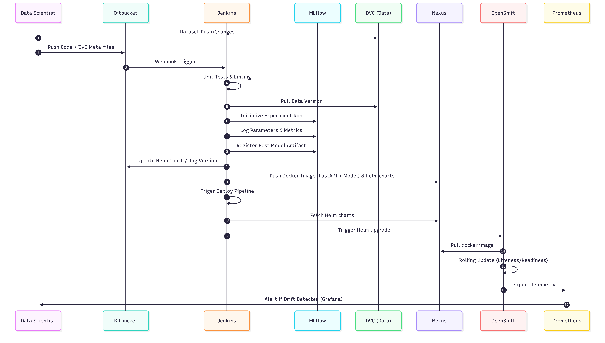

# stc MLOps Workflow: Production Machine Learning System

This document details the end-to-end MLOps workflow for building, deploying, and maintaining production-grade machine learning systems within the stc CI/CD framework. It provides a standardized approach to lifecycle management, emphasizing automation, reliability, and continuous delivery.

---

## 1. Overview of the ML Lifecycle

The Machine Learning lifecycle at stc is a continuous, automated, and observable process. It extends traditional DevOps principles to include data engineering and machine learning specific challenges. The lifecycle treats both **code** and **data** as first-class citizens, ensuring that every prediction in production can be traced back to the exact dataset, code version, and environment used to train the model. The ultimate goal is to accelerate time-to-market for AI solutions while maintaining strict governance, reliability, and scalability.

---

## 2. L2 Detailed Workflow (Sequence)

---

## 3. End-to-End Workflow Process Detail

### 3.1 Data Versioning

* **Process:** Tracking the state of datasets over time.
* **Mechanism:** Creating immutable snapshots of datasets using tools (e.g., DVC) and binding these data versions directly to corresponding Git commits, ensuring perfect reproducibility.

### 3.2 Model Training Pipelines

* **Process:** Fitting ML algorithms to the prepared features.
* **Mechanism:** Distributed, containerized training jobs executed on a scalable cluster. Includes automated hyperparameter tuning and cross-validation procedures.

### 3.3 Experiment Tracking

* **Process:** Logging the metadata of every training run.
* **Mechanism:** Recording parameters, performance metrics, and learning curves centrally. This allows data scientists to compare dozens of experiments visually and programmatically to select the optimal model.

### 3.4 Model Evaluation & Validation

* **Process:** Testing the candidate model's readiness for production.
* **Mechanism:** Automated scoring against holdout validation datasets. Evaluating business KPIs, execution speed, and ensuring fairness/bias checks pass before a model can be promoted.

### 3.5 Model Registry & Versioning

* **Process:** Centralized cataloging of approved models and deployment packages.
* **Mechanism:** Transitioning serialized model artifacts through distinct lifecycle stages (e.g., `Staging` -> `Production`). Jenkins tags the version in Bitbucket and updates the Helm deployment charts to reflect the new model version.

### 3.6 Deployment (Batch and Real-time Inference)

* **Real-time:** Jenkins triggers a dedicated **Deploy Pipeline**. This pipeline fetches the container image and Helm charts from the Nexus registry, initiating a `helm upgrade` on the OpenShift cluster for zero-downtime rolling updates.
* **Batch:** Scheduled inference jobs generating predictions on large datasets at rest.

---

## 4. CI/CD Strategy for ML

### 4.1 Code Pipelines

* **Continuous Integration (CI):** Triggered on every commit/Pull Request. Executes code linting, static analysis, unit testing (e.g., using `pytest`), and security vulnerability scanning.
* **Continuous Delivery (CD):** Following successful CI, the pipeline builds immutable Docker container images and pushes them to the artifact registry (Nexus).

### 4.2 Model Pipelines

* **Continuous Training (CT):** The hallmark of MLOps. Automated pipelines trigger the entire training process (data pull -> train -> evaluate) without human intervention when new data arrives or code is merged.
* **Automated Promotion:** If a freshly trained model in the CT pipeline outperforms the current production baseline on a golden dataset, it is automatically flagged for staging.

### 4.3 Infrastructure Automation

* **Infrastructure as Code (IaC):** Provisioning compute clusters, storage volumes, and networking via code (Terraform/Helm), eliminating configuration drift.
* **GitOps:** Using Git as the single source of truth for the environment state, dynamically syncing the production cluster to mirror the Bitbucket repository configurations.

---

## 5. Monitoring & Observability

### 5.1 System Health Monitoring

* Tracking the purely technical metrics of the ML APIs and infrastructure.
* **Metrics:** Latency (response time), throughput (RPS), error rates (5xx/4xx), CPU/memory utilization, and network I/O.

### 5.2 Data Drift Detection

* Monitoring the statistical properties of the incoming serving data compared to the original training data.
* **Metrics:** Feature drift, missing value spikes, and out-of-bounds categorical variables.

### 5.3 Model Performance Monitoring

* Tracking the actual business and ML metrics of the model over time.
* **Metrics:** Accuracy, precision, recall, MAE, RMSE. Where ground truth is delayed, proxy metrics and output distribution drift are monitored.

---

## 6. Automated Retraining Strategy

Models degrade over time. The system employs multiple triggers to initiate automated retraining:

1. **Schedule-Based:** Triggered chronologically (e.g., every Sunday at 2 AM) to capture baseline time-driven patterns.
2. **Performance-Based:** Triggered immediately if the Model Performance Monitoring component detects that accuracy has dropped below a predefined acceptable threshold.
3. **Data Drift-Based:** Triggered if significant changes in the input data distribution are detected, indicating the model's learned patterns are becoming obsolete.

---

## 7. Feedback Loop Integration

* **Ground Truth Joining:** Automated systems capture the final outcomes (e.g., did the customer actually churn?) and join them with the historical model predictions.
* **Data Lake Ingestion:** This unified dataset is fed back into the data lake, creating the foundational training data for the next generation of the model.
* **Human-in-the-Loop:** Predictions that fall into a low-confidence band can be automatically routed to a queue for human expert review, creating high-quality labeled data for future iterations.

---

## 8. Governance

### 7.1 Reproducibility

* Systems are designed so that any historical prediction can be audited.
* **Traceability:** Model Artifact (Registry) -> Training Run (Experiment Tracker) -> Docker Image Hash (Container Registry) -> Code Commit (Bitbucket) -> Data Snapshot (DVC).

### 7.2 Auditability

* Strict, immutable logging of all CI/CD pipeline executions, model promotions, and infrastructure changes. Every action is tied to an authenticated user or service account.

### 7.3 Compliance

* Ensuring data privacy (masking PII in training sets), enforcing Role-Based Access Control (RBAC) across all tools, and complying with internal stc security policies and local data residency regulations.

---

## 9. Tooling Ecosystem

| Component | Tool | Justification |
| :--- | :--- | :--- |
| **Source Control** | Bitbucket | stc enterprise standard; robust access controls and integration. |
| **CI/CD Orchestration** | Jenkins | Industry-proven, highly customizable, integrates deeply with Bitbucket & OpenShift. |
| **Artifact Management** | Nexus | Secure, centralized storage for Python packages and Docker images. |
| **Container Platform** | OpenShift / K8s | Enterprise-grade orchestration, providing necessary scaling, security, and GitOps support. |
| **Experiment & Registry** | MLflow | De facto standard for lifecycle tracking, offering lightweight integrations and robust model registry UI. |
| **Data Versioning** | DVC + MinIO/CephFS | Git-like experience for large datasets backed by enterprise S3-compatible resilient storage. |
| **Drift Detection** | Evidently AI | Leading open-source framework for comprehensive statistical model drift and data distribution analytics. |
| **Observability** | Prometheus & Grafana | Deeply integrated into OpenShift for real-time telemetry, alerting, and customizable dashboards. |

---

## 10. Environment Setup

* **Development (Dev):**
  * Sandbox for Data Scientists.
  * Uses anonymized, down-sampled data slices.
  * Focused on interactive experimentation (Jupyter) and algorithm prototyping.
* **Staging (QA):**
  * Mirror of production.
  * Uses production-like data volumes.
  * Dedicated to automated integration testing, load testing, and shadow/canary deployments to validate system stability.
* **Production (Prod):**
  * Highly secured, locked-down environment.
  * Only accessible via automated CI/CD pipelines (no human direct access).
  * Auto-scaling enabled, handling live stc customer traffic and mission-critical batch jobs.

---

*Prepared for the stc MLOps Engineering and Architecture Team.*
