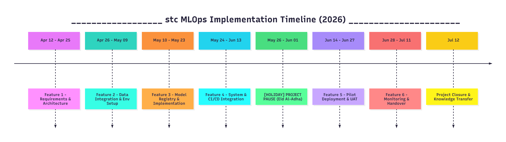

<h1 align="center">Executive MLOps Implementation Roadmap</h1>
<h3 align="center">stc CI/CD Framework Integration</h3>

## 1. Executive Summary

As stc continues its digital transformation and expands its AI capabilities, the need for a robust, scalable, and automated infrastructure to transition machine learning models from development to production has become critical. Currently, fragmented workflows and manual handover processes hinder model time-to-market, increase operational overhead, and introduce risks of model degradation in production.

This roadmap outlines the strategic implementation of an enterprise-grade MLOps platform seamlessly integrated into stc's existing CI/CD framework. By automating the end-to-end ML lifecycle—from data validation and model training to deployment and continuous monitoring—this proposed solution will drive business agility, ensure high-fidelity AI performance, and maximize the return on investment (ROI) for stc's data science initiatives.

---

## 2. Objectives and Expected Business Outcomes

### Strategic Objectives

* **Standardization:** Establish a unified, reproducible framework for building, testing, and deploying ML models across all stc business units.
* **Automation:** Eliminate manual bottlenecks in the ML lifecycle by fully integrating with the stc CI/CD pipelines (Jenkins/Bitbucket/GitLab).
* **Governance & Auditability:** Ensure absolute traceability of model versions, data lineage, and compliance with enterprise security standards.

### Expected Business Outcomes

* **Accelerated Time-to-Market:** Reduce the lead time for deploying new AI capabilities from months to days.
* **Operational Efficiency:** Substantially lower OPEX by fully automating resource provisioning and deployment processes.
* **Enhanced Decision-Making:** Uninterrupted, high-quality predictive insights driving core stc functions (e.g., predictive network maintenance, hyper-personalized marketing, and proactive churn prevention).

---

## 3. Key Success Metrics (KPIs)

To measure the success of this initiative, the following KPIs will be tracked at the executive level:

* **Deployment Frequency:** Increase the rate of model updates and deployments into production (Target: Weekly/On-demand).
* **Lead Time for Changes:** Reduce the cycle time from code commit to production availability by >80%.
* **System Uptime & Availability:** Maintain 99.99% availability for all ML serving endpoints.
* **Drift Detection Latency:** Identify model or data drift in production environments within 1 hour of occurrence.
* **Infrastructure Utilization:** Achieve optimal compute efficiency with dynamic scaling for training and serving clusters.

---

## 4. Scope Definition

### In-Scope

* **CI/CD Integration:** Embedding MLOps capabilities (training workflows, model registry, deployment pipelines) into stc's current CI/CD orchestration tools.
* **Model Training & Evaluation Pipelines:** Setting up automated model training, validation, and evaluation workflows.
* **Model Serving:** Containerized deployment of models on stc's OpenShift/Kubernetes infrastructure.
* **Monitoring Systems:** Establishing telemetry for API health and model drift observability.
* **Pilot Migration:** Onboarding 2-3 high-impact, existing machine learning use cases to the new MLOps platform.

### Out-of-Scope

* Automated data extraction, transformation, and validation pipelines (ETL/ELT).
* Feature store implementation and management.
* Restructuring of core enterprise Data Lakes or Data Warehouses.
* Development of new AI algorithms or foundational machine learning research from scratch.
* IT service management (ITSM) platform redesign outside the context of AI ticketing.

---

## 5. Phased Implementation Plan

The project will be executed as six core features to ensure stability and alignment with business goals.

### Feature 1: Requirements Finalization & Planning (Apr 12 - Apr 25)

* Define precise technical specifications and architecture blueprints tailored to stc's hybrid cloud environment.
* Identify the pilot AI use cases for initial rollout.
* Finalize security, compliance, and governance criteria.

### Feature 2: Data Integration & Environment Setup (Apr 26 - May 09)

* Establish secure connectivity to existing stc data sources for model consumption.
* Configure development and staging environments with required libraries and dependencies.
* Define data interface standards for model training inputs.

### Feature 3: Model Development & Implementation (May 10 - May 23)

* Establish a centralized Model Registry (e.g., MLflow) for version controlling models, parameters, and metrics.
* Containerize training environments to guarantee reproducibility across development and production.
* Implement automated hyperparameter tuning and model retraining scripts.

### Feature 4: System Integration (May 24 - Jun 13)

* Integrate the complete ML pipeline into the stc CI/CD framework.
* Configure continuous integration (CI) to automatically trigger tests upon code or data changes.
* Setup continuous delivery (CD) for seamless promotion of models across Dev, Staging, and Production environments.

### [HOLIDAY] Project Pause (May 26 - Jun 01)

* Mandatory pause for Eid Al-Adha / Public Holidays.
* No development or deployment activities scheduled during this period.

### Feature 5: Deployment & Rollout (Jun 14 - Jun 27)

* Execute green/blue or canary deployments for zero-downtime model releases.
* Migrate the selected pilot use cases onto the new fully-automated MLOps infrastructure.
* Conduct user acceptance testing (UAT) and load testing.

### Feature 6: Monitoring & Continuous Improvement (Jun 28 - Jul 11)

* Deploy observability tools (e.g., Prometheus, Grafana, Evidently AI) for real-time tracking of system health and model accuracy.
* Implement automated alerting mechanisms for performance degradation or data drift.
* Transition to a continuous feedback loop and continuous training (CT) operations.

---

## 6. Timeline with Key Milestones

* **Month 1:** Feature 1 & 2 - Planning & Data Integration *(Milestone: System Architecture & Data Access Approved)*
* **Month 2:** Feature 3 & 4 - Model Development & CI/CD Integration *(Milestone: Automated Pipeline Orchestration Online)*
* **Holidays:** May 26 - June 1 *(Project Pause for Eid Al-Adha / Public Holidays)*
* **Month 3:** Feature 5 & 6 - Deployment, Monitoring & Handover *(Milestone: Full MLOps Capability Operational)*

---

## 7. Visual Roadmap (Implementation Timeline)

---

## 8. Resource Plan

A cross-functional squad is required to ensure seamless delivery:

* **MLOps Architect (1):** Oversees end-to-end design, CI/CD integration, and infrastructure alignment.
* **Machine Learning Engineers (2):** Develop training scripts, optimize models, and integrate model registries.
* **DevOps/Site Reliability Engineer (SRE) (1):** Manages containerization, OpenShift deployment, and system telemetry configuration.
* **Project Manager / Scrum Master (1):** Manages timelines, cross-team blockers, and executive reporting.
* **Data Scientists (Consultative):** Provide subject matter expertise on the pilot use cases and model validation parameters.

---

## 9. Infrastructure & Tooling Requirements

The following enterprise technologies will be integrated within stc's environment:

* **Orchestration & CI/CD:** GitLab CI / Jenkins / Bitbucket Pipelines
* **Model Registry & Tracking:** MLflow (Enterprise) / Weights & Biases
* **Containerization & Compute:** Docker, stc OpenShift / Kubernetes Clusters
* **Model Monitoring:** Evidently AI, Prometheus, Grafana
* **Storage:** CephFS (for shared persistent volumes), MinIO / S3 (for artifact storage)
* **Code Repository:** Bitbucket / GitLab

---
